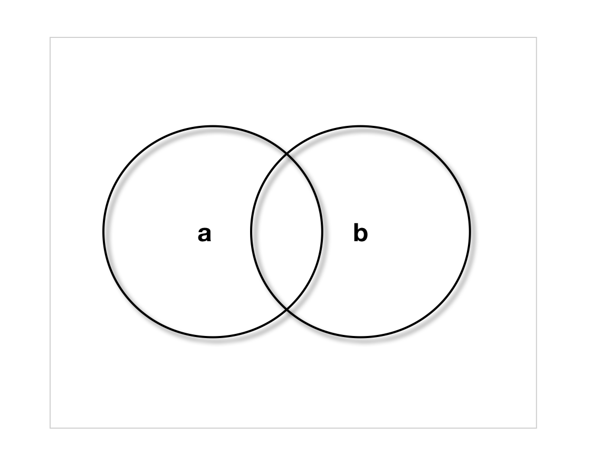
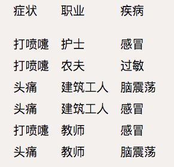

### 条件概率

P(a∩b) = P(a|b)P(b)=P(b|a)P(a)  

**贝叶斯公式**：
```
P(a|b)=P(b|a)P(a)/P(b)
其中P(b|a)：likelihood 似然值
P(a)：先验概率
```

### 贝叶斯例子
假设有100枚硬币，其中99枚硬币都是1正(H)1反(T)，有1枚硬币是特殊硬币(S)2个都是正面。
已知在发现是正面的情况下是特殊硬币的概率
```
P(coin=S|H) = P(H|coin=S)*P(coin=S)/P(H)

P(H|coin=S):特殊硬币中是正面的概率：1
P(coin=S):特殊硬币的概率：1/100
P(H):正面的概率 101/200

P(coin=S|H)=2/101
```
**朴素贝叶斯Naive Bayse例子**


  
现在又来了第七个病人，是一个打喷嚏的建筑工人。请问他患上感冒的概率有多大？
```
# 求解过程
P(a|b)=P(b|a)P(a)/P(b)

P(感冒|打喷嚏*建筑工人)=P(打喷嚏*建筑工人|感冒)*P(感冒)/P(打喷嚏*建筑工人)

由于打喷嚏和感冒事件相互独立,

P(打喷嚏*建筑工人|感冒)=P(打喷嚏|感冒)*P(建筑工人|感冒)
P(打喷嚏*建筑工人)=P(打喷嚏)*P(建筑工人)

P(感冒|打喷嚏*建筑工人)=P(打喷嚏|感冒)*P(建筑工人|感冒)*P(感冒)/P(打喷嚏)/P(建筑工人)=0.66 x 0.33 x 0.5 / 0.5 / 0.33=0.66
```
**朴素贝叶斯分类器**
  
假设有n维特征F1,F2...Fn,分类结果C有m种情况C1,C2...Cm,朴素贝叶斯要解决的问题就是求出max(P(C|F1F2...Fn)),得到分类的结果
```
P(C|F1F2...Fn)=P(F1F2...Fn|C)*P(C)/P(F1F2...Fn)

由于P(F1F2...Fn)是确定值，只需求出P(F1F2...Fn|C)*P(C)最大值

F1⊥F2...⊥Fn

P(F1F2...Fn|C=Ci)*P(C=Ci)=P(F1|C=Ci)*P(F2|C=Ci)...P(Fn|C=Ci)*P(C=Ci)

```

> 引用秦曾昌老师机器学习课程
>
> 引用阮一峰老师[朴素贝叶斯博文](http://www.ruanyifeng.com/blog/2013/12/naive_bayes_classifier.html)

